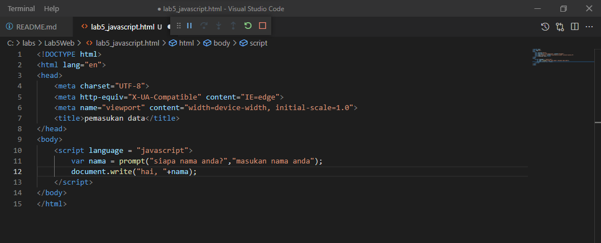
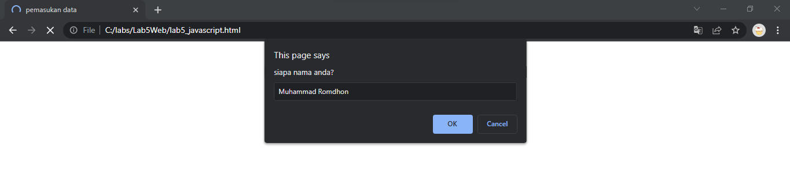
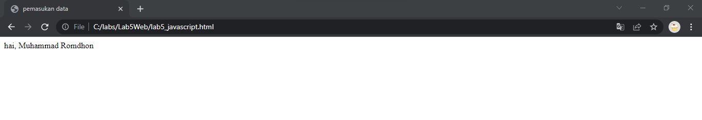
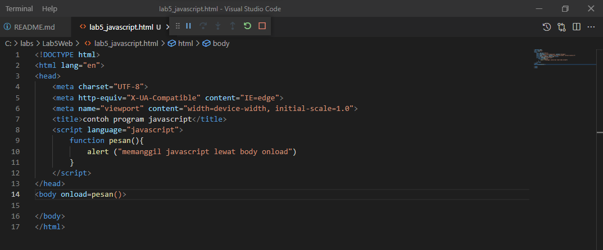
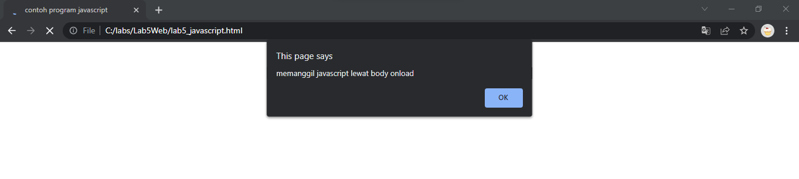

# lab5web
# Nama  : Muhammad Romdhon
# NIM   : 312010434
# Kelas : TI.20.A1

# Langkah-langkah praktikum
 Persiapan membuat dokumen HTML dengan nama file lab5_javascript.html seperti berikut.

# 1. Javascript Dasar
 Pemakaian Alert sebagai property window.

 Pemakaian method dalam objek

 Pemakaian Prompt

 Pembuatan Fungsi dan cara pemanggilannya

